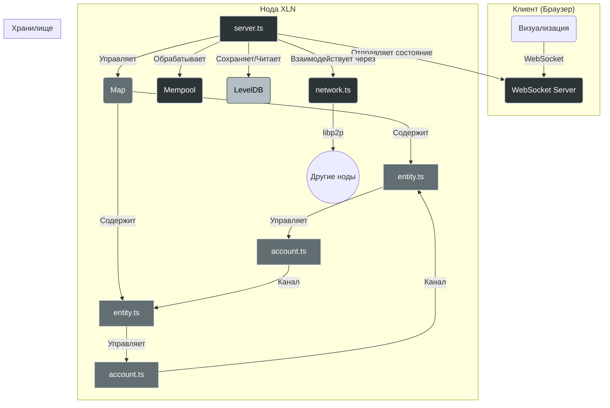

## Техническое задание XLN от заказчика (не менять!)

## Разработать три файла:

### server.ts
Главный файл системы. Управляет картой Entity-машин, обрабатывает блоки каждые 100мс, сохраняет снэпшоты состояния в LevelDB через RLP-сериализацию. Содержит глобальный мемпул транзакций, отправляет состояние в браузер через WebSocket. Реализует восстановление из последнего блока при перезапуске.

### entity.ts 
Финансовая организация с кворумным управлением. Хранит резервы, долги, каналы с другими Entity. Обрабатывает предложения через голосование (например 3-из-5 подписей). Управляет Account-машинами для двусторонних транзакций. Эскалирует споры на Jurisdiction-уровень при необходимости.

### account.ts
Двусторонний канал между двумя Entity. Синхронизированное состояние с unicast-обменом сообщениями. Обрабатывает приватные транзакции без broadcast, использует систему квитанций (receipt) для подтверждений. При конфликтах автоматически откатывается по правилу "правый побеждает".

## Хранение
Блоки в LevelDB с ключами block_${height}, данные в RLP-формате. Map/BigInt/Buffer сериализуются нативно через RLP. Мемпулы хранятся как Map<entityId, Transaction[]> в памяти.

## Цель
Симуляция 20 Entity с приватными транзакциями, визуализация в браузере, машина времени для отладки.

Конец тз. 

# План реализации системы XLN (v4, финал)

Этот документ описывает архитектуру, технологический стек и поэтапный план разработки децентрализованной системы XLN. План сфокусирован на высокой производительности, использует легковесные, EVM-совместимые криптографические примитивы и **оптимизирован для сохранения блоков только при наличии транзакций**.

## 1. Чек-лист выполнения

### Фаза 1: Ядро системы и хранилище
- [x] Настроить `eth-crypto` (установлен)
- [x] Определить структуры данных (`Transaction`, `Receipt`, `Proposal`) (в `src/types.ts`)
- [x] **Реализовать класс `Server` (в `src/server.ts`)**
- [x] **Реализовать класс `Entity` (в `src/entity.ts`)**
- [x] **Интегрировать `LevelDB` в `Server` для сохранения блоков**
- [x] Реализовать RLP-сериализацию для блоков
- [x] **Написать интеграционные тесты для `Server` и `LevelDB` (в `tests/integration/server.test.ts`)**
- [x] **Настроить интервал майнинга блоков на 100мс**
- [x] **Реализовать сохранение артефактов LevelDB после тестов**
- [ ] **Написать Unit-тесты для `Entity` (в `tests/unit/entity.test.ts`)**

### Фаза 2: Реализация Account и бизнес-логики
- [x] Реализовать класс `Account` (в `src/account.ts`)
- [x] Написать Unit-тесты для `Account` (в `tests/unit/account.test.ts`)
- [ ] Интегрировать `Account` в `Entity`

### Фаза 3: Сетевое взаимодействие
- [ ] Интегрировать `libp2p` в `network.ts`
- [ ] Реализовать протокол обмена транзакциями
- [ ] Связать `Server` и `network`
- [ ] Написать интеграционные тесты для P2P-взаимодействия
- [ ] Настроить `libp2p-webrtc-star` сервер в Docker

### Фаза 4: Визуализация
- [ ] Реализовать WebSocket-сервер
- [ ] Создать клиентское приложение
- [ ] Реализовать визуализацию графа Entity
- [ ] Реализовать "машину времени"

## 2. Концепция системы

**XLN** — это высокопроизводительная система для симуляции и управления финансовыми взаимодействиями между автономными единицами (Entity). Система спроектирована для обработки приватных транзакций в двусторонних каналах (Account) с высокой частотой и низкой задержкой. Управление ключевыми операциями осуществляется через механизм кворумного голосования.

## 3. Архитектура



### Компоненты:

-   **`server.ts` (Ядро системы):**
    -   Главный управляющий процесс.
    -   **Запускает цикл обработки блока по событию (например, каждые 100 мс, но только если мемпул не пуст).**
    -   Управляет коллекцией `Entity` (`EntityMap`).
    -   Хранит глобальный мемпул транзакций.
    -   Осуществляет RLP-сериализацию и сохранение снэпшотов состояния в LevelDB.
    -   Реализует WebSocket-сервер для отправки данных на клиент.
    -   Интегрируется с `network.ts` для P2P-обмена.

-   **`entity.ts` (Сущность/Организация):**
    -   Абстракция, представляющая как отдельного пользователя, так и DAO.
    -   Владеет парой ключей (приватный/публичный), сгенерированной из 12-словной seed-фразы (BIP39).
    -   Использует приватный ключ для подписи транзакций и предложений (ECDSA на кривой secp256k1).
    -   Хранит резервы, долги и управляет каналами (`Account`).
    -   Реализует логику кворумного голосования (проверка нескольких подписей).

-   **`account.ts` (Двусторонний канал):**
    -   Приватный канал между двумя `Entity`.
    -   Обрабатывает транзакции без широковещательной рассылки (unicast).
    -   Использует систему квитанций (`receipt`), подписанных обеими сторонами, для подтверждения операций.
    -   Реализует правило разрешения конфликтов "правый побеждает".

-   **`network.ts` (Сетевой модуль):**
    -   Отвечает за P2P-взаимодействие между нодами.
    -   Использует `libp2p` для обнаружения пиров и установки соединений.
    -   Определяет протоколы для обмена транзакциями, блоками и квитанциями.

## 4. Технологический стек

-   **Язык:** TypeScript
-   **Среда выполнения:** Node.js
-   **Криптография:** **`eth-crypto`** (для генерации ключей, подписи и верификации EVM-совместимых сообщений).
-   **База данных:** LevelDB (с возможностью миграции на RocksDB).
-   **Сериализация:** RLP (`@ethereumjs/rlp`)
-   **P2P-сеть:** `libp2p` с `libp2p-webrtc-star` для обнаружения пиров.
-   **Веб-сокеты:** `ws`
-   **Контейнеризация:** Docker, Docker Compose

## 5. Поэтапный план реализации

(Детальное описание фаз опущено для краткости, см. чек-лист выше)

## 6. Структура проекта

```
k/
├── jest.config.js
├── package.json
├── readme.md
├── tsconfig.json
├── src/
│   ├── account.ts
│   ├── crypto.ts
│   ├── entity.ts
│   └── types.ts
└── tests/
    ├── integration/
    └── unit/
        └── account.test.ts
```

### Описание файлов:
-   **`k/`**: Корневая директория проекта.
    -   **`jest.config.js`**: Конфигурация для тестового фреймворка Jest.
    -   **`package.json`**: Определяет зависимости проекта и скрипты.
    -   **`readme.md`**: Документация проекта.
    -   **`tsconfig.json`**: Конфигурация компилятора TypeScript.
    -   **`src/`**: Директория с исходным кодом.
        -   `server.ts`: Реализация класса `Server`.
        -   `entity.ts`: Реализация класса `Entity`.
        -   `account.ts`: Реализация класса `Account`.
        -   `crypto.ts`: Криптографические утилиты.
        -   `types.ts`: Определения типов данных.
    -   **`tests/`**: Директория с тестами.
        -   `integration/`: Для интеграционных тестов.
            -   `server.test.ts`: Интеграционные тесты для `Server` и `LevelDB`.
        -   `unit/`: Для юнит-тестов.
            -   `entity.test.ts`: Юнит-тесты для `Entity`.
            -   `account.test.ts`: Юнит-тесты для `Account`.

## 7. Среда для разработки и тестирования

Для эмуляции реальных сетевых условий будет использоваться **Docker Compose**.
-   **Конфигурация:** Два Docker-контейнера (`node-a`, `node-b`) для начального тестирования. В дальнейшем планируется расширение до конфигурации с несколькими участниками (Алиса, Боб, и до 20 других пользователей) и отдельным `star-server` для обнаружения пиров.
-   **Эмуляция задержки:** С помощью `tc` (Traffic Control) будет добавлена искусственная задержка (300 мс).
-   **Ключи для тестов:** Каждая нода будет инициализироваться с помощью `eth-crypto`.

## 8. Затыки и решения

В процессе разработки и тестирования модуля `Account` возникли проблемы с валидацией транзакций и обновлением балансов, а также с разрешением конфликтов.

**Проблема 1: Некорректное обновление балансов и разрешение конфликтов.**
Изначально логика обновления балансов в `Account.applyTransaction` и механизм `Account.resolveConflict` не учитывали, какой из `EntityID` (A или B) является отправителем/получателем в контексте `channelId`. Это приводило к неверному изменению балансов и некорректному откату состояния при конфликтах.

**Решение 1:**
Класс `Account` был изменен для явного хранения `entityA` и `entityB` (идентификаторов сторон канала) в конструкторе. Логика `applyTransaction` теперь использует эти сохраненные ID для корректного определения, какой баланс (A или B) должен быть изменен. Метод `resolveConflict` был доработан для восстановления состояния канала на основе `lastReceipt.transaction`, что позволяет правильно откатывать балансы к последнему подтвержденному состоянию.

**Проблема 2: Отсутствие объекта транзакции в квитанции (Receipt).**
Для корректного разрешения конфликтов и восстановления состояния, `Receipt` должен содержать полную информацию о транзакции, которую он подтверждает. Изначально в интерфейсе `Receipt` отсутствовало поле `transaction`.

**Решение 2:**
В интерфейс `Receipt` (файл `src/types.ts`) было добавлено поле `transaction: Transaction;`. Соответствующие места в коде (`src/account.ts`, `src/entity.ts` и `tests/unit/account.test.ts`), где создаются или обрабатываются квитанции, были обновлены для включения полного объекта транзакции.

**Проблема 3: Несоответствие публичных ключей при валидации подписей.**
Функция `EthCrypto.recover` (используемая изначально) возвращает Ethereum-адрес (хеш публичного ключа), тогда как `EntityID` в нашей системе представляет собой полный публичный ключ. Это приводило к несоответствию при сравнении восстановленных публичных ключей с `EntityID` отправителя и получателя транзакции.

**Решение 3:**
Была произведена замена `EthCrypto.recover` на `EthCrypto.recoverPublicKey` в файле `src/crypto.ts`. Функция `EthCrypto.recoverPublicKey` корректно восстанавливает полный публичный ключ из подписи и хеша сообщения, что позволяет правильно сопоставлять его с `EntityID`. Также было подтверждено, что функция `removeHexPrefix` корректно обрабатывает публичные ключи, удаляя префикс `0x` для обеспечения единообразия формата.

removeHexPrefix надо использовать. 

## 9. Запуск тестов

### Интеграционные тесты сервера
```bash
# Запуск всех интеграционных тестов сервера
npm test -- tests/integration/server.test.ts

# Запуск конкретного теста
npm test -- tests/integration/server.test.ts -t "should create blocks every second"
```

### Unit-тесты аккаунтов
```bash
# Запуск unit-тестов для Account
npm test -- tests/unit/account.test.ts
```

### Все тесты
```bash
# Запуск всех тестов
npm test
```

### Артефакты тестирования
После запуска интеграционных тестов сервера артефакты LevelDB сохраняются в:
- `tests/integration/leveldb-artifacts/db-{timestamp}/` - копии баз данных
- `tests/integration/leveldb-artifacts/db-summary-{timestamp}.txt` - текстовые сводки содержимого

## 10. Текущее состояние системы

### Реализовано:
- ✅ **Класс Server** с майнингом блоков каждые 100мс
- ✅ **Класс Entity** с кворумным управлением и транзакциями
- ✅ **Класс Account** для двусторонних каналов
- ✅ **RLP-сериализация** сложных структур (Map, BigInt, Buffer)
- ✅ **LevelDB интеграция** с сохранением блоков
- ✅ **WebSocket сервер** для broadcast блоков
- ✅ **Восстановление состояния** из последнего блока
- ✅ **Полные интеграционные тесты** с артефактами

### Структура блоков в LevelDB:
Каждый блок содержит:
- `height` - высота блока (0, 1, 2...)
- `inputs` - массив входных данных от Entity
- `timestamp` - временная метка создания

## 11. Дальнейшие шаги

### Приоритет 1: Интеграция Account в Entity
1. **Добавить управление каналами в Entity:**
   - Создание двусторонних каналов между Entity
   - Интеграция Account в систему голосования
   - Обработка приватных транзакций через каналы

2. **Написать unit-тесты для Entity:**
   - Тесты кворумного голосования
   - Тесты создания и управления каналами
   - Тесты интеграции с Account

### Приоритет 2: P2P сетевое взаимодействие
1. **Реализовать network.ts:**
   - Интеграция libp2p
   - Протоколы обмена транзакциями
   - Обнаружение пиров

2. **Docker-конфигурация:**
   - Контейнеры для multi-node тестирования
   - Эмуляция сетевых задержек
   - WebRTC star server

### Приоритет 3: Визуализация и отладка
1. **Веб-интерфейс:**
   - Реального времени визуализация Entity
   - Граф транзакций и каналов
   - "Машина времени" для просмотра истории

2. **Мониторинг и метрики:**
   - Производительность майнинга
   - Статистика транзакций
   - Здоровье P2P сети

### Приоритет 4: Оптимизация и масштабирование
1. **Производительность:**
   - Оптимизация RLP-сериализации
   - Сжатие данных в LevelDB
   - Параллельная обработка транзакций

2. **Масштабирование:**
   - Поддержка 20+ Entity
   - Horizontal sharding
   - Load balancing для WebSocket 