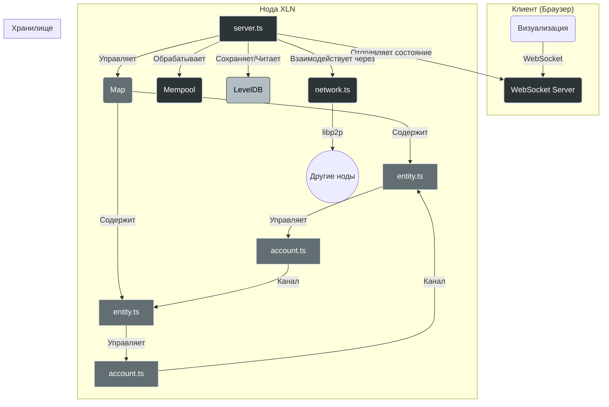

# План реализации системы XLN (v4, финал)

Этот документ описывает архитектуру, технологический стек и поэтапный план разработки децентрализованной системы XLN. План сфокусирован на высокой производительности, использует легковесные, EVM-совместимые криптографические примитивы и **оптимизирован для сохранения блоков только при наличии транзакций**.

## 1. Чек-лист выполнения

### Фаза 1: MVP и криптография
- [ ] Настроить `eth-crypto`
- [ ] Определить структуры данных (`Transaction`, `Receipt`, `Proposal`)
- [ ] Реализовать класс `Account`
- [ ] Реализовать класс `Entity`
- [ ] Реализовать класс `Server` (в памяти)
- [ ] Написать Unit-тесты для `Account` и `Entity`

### Фаза 2: Хранилище и состояние
- [ ] Интегрировать `LevelDB`
- [ ] Реализовать RLP-сериализацию
- [ ] Реализовать сохранение снэпшотов (только для непустых блоков)
- [ ] Реализовать восстановление состояния при запуске
- [ ] Написать интеграционные тесты для хранилища

### Фаза 3: Сетевое взаимодействие
- [ ] Интегрировать `libp2p` в `network.ts`
- [ ] Реализовать протокол обмена транзакциями
- [ ] Связать `Server` и `network`
- [ ] Написать интеграционные тесты для P2P-взаимодействия
- [ ] Настроить `libp2p-webrtc-star` сервер в Docker

### Фаза 4: Визуализация
- [ ] Реализовать WebSocket-сервер
- [ ] Создать клиентское приложение
- [ ] Реализовать визуализацию графа Entity
- [ ] Реализовать "машину времени"

## 2. Концепция системы

**XLN** — это высокопроизводительная система для симуляции и управления финансовыми взаимодействиями между автономными единицами (Entity). Система спроектирована для обработки приватных транзакций в двусторонних каналах (Account) с высокой частотой и низкой задержкой. Управление ключевыми операциями осуществляется через механизм кворумного голосования.

## 3. Архитектура

### Компоненты:

-   **`server.ts` (Ядро системы):**
    -   Главный управляющий процесс.
    -   **Запускает цикл обработки блока по событию (например, каждые 100 мс, но только если мемпул не пуст).**
    -   Управляет коллекцией `Entity` (`EntityMap`).
    -   Хранит глобальный мемпул транзакций.
    -   Осуществляет RLP-сериализацию и сохранение снэпшотов состояния в LevelDB.
    -   Реализует WebSocket-сервер для отправки данных на клиент.
    -   Интегрируется с `network.ts` для P2P-обмена.

-   **`entity.ts` (Сущность/Организация):**
    -   Абстракция, представляющая как отдельного пользователя, так и DAO.
    -   Владеет парой ключей (приватный/публичный), сгенерированной из 12-словной seed-фразы (BIP39).
    -   Использует приватный ключ для подписи транзакций и предложений (ECDSA на кривой secp256k1).
    -   Хранит резервы, долги и управляет каналами (`Account`).
    -   Реализует логику кворумного голосования (проверка нескольких подписей).

-   **`account.ts` (Двусторонний канал):**
    -   Приватный канал между двумя `Entity`.
    -   Обрабатывает транзакции без широковещательной рассылки (unicast).
    -   Использует систему квитанций (`receipt`), подписанных обеими сторонами, для подтверждения операций.
    -   Реализует правило разрешения конфликтов "правый побеждает".

-   **`network.ts` (Сетевой модуль):**
    -   Отвечает за P2P-взаимодействие между нодами.
    -   Использует `libp2p` для обнаружения пиров и установки соединений.
    -   Определяет протоколы для обмена транзакциями, блоками и квитанциями.

## 4. Технологический стек

-   **Язык:** TypeScript
-   **Среда выполнения:** Node.js
-   **Криптография:** **`eth-crypto`** (для генерации ключей, подписи и верификации EVM-совместимых сообщений).
-   **База данных:** LevelDB (с возможностью миграции на RocksDB).
-   **Сериализация:** RLP (`@ethereumjs/rlp`)
-   **P2P-сеть:** `libp2p` с `libp2p-webrtc-star` для обнаружения пиров.
-   **Веб-сокеты:** `ws`
-   **Контейнеризация:** Docker, Docker Compose

## 5. Поэтапный план реализации

(Детальное описание фаз опущено для краткости, см. чек-лист выше)

## 6. Среда для разработки и тестирования

Для эмуляции реальных сетевых условий будет использоваться **Docker Compose**.
-   **Конфигурация:** Два Docker-контейнера (`node-a`, `node-b`).
-   **Эмуляция задержки:** С помощью `tc` (Traffic Control) будет добавлена искусственная задержка (300 мс).
-   **Ключи для тестов:** Каждая нода будет инициализироваться с помощью `eth-crypto`.

## 7. Затыки и решения

В процессе разработки и тестирования модуля `Account` возникла проблема с валидацией подписей, которая приводила к падению тестов.

**Проблема:**
Функция `EthCrypto.recover` (используемая изначально) возвращает Ethereum-адрес (хеш публичного ключа), тогда как `EntityID` в нашей системе представляет собой полный публичный ключ. Это приводило к несоответствию при сравнении восстановленных публичных ключей с `EntityID` отправителя и получателя транзакции.

**Решение:**
Была произведена замена `EthCrypto.recover` на `EthCrypto.recoverPublicKey` в файле `src/crypto.ts`. Функция `EthCrypto.recoverPublicKey` корректно восстанавливает полный публичный ключ из подписи и хеша сообщения, что позволяет правильно сопоставлять его с `EntityID`. Также было подтверждено, что функция `removeHexPrefix` корректно обрабатывает публичные ключи, удаляя префикс `0x` для обеспечения единообразия формата.
