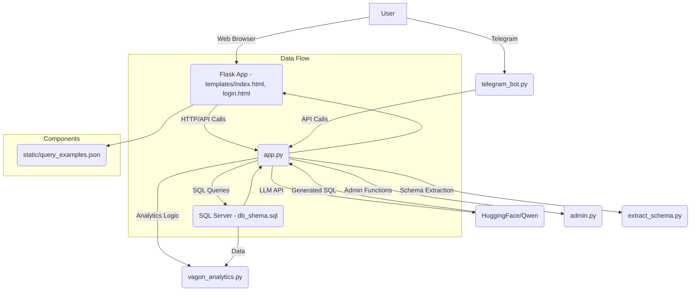

# Vagon Project

This project is a web application related to wagon analytics.

## File Structure

```
vagon/
├── README.md
├── app.py
├── llm_prompt_template.txt
├── telegram_bot.py
├── vagon_analytics.py
├── __pycache__/
├── db_shema.sql
├── requirements.txt
├── static/
│   └── query_examples.json
├── templates/
│   ├── index.html
│   └── login.html
├── tests/
│   ├── __init__.py
│   ├── __pycache__/
│   ├── test_charts.py
│   ├── test_integration.py
│   ├── test_services.py
│   ├── test_sql_issues.py
└── venv/
```

## SQL Query Error Investigation

The following SQL query failed:

```sql
SELECT
[Статус вагона],
COUNT(*) AS [Количество вагонов]
FROM [OperativeReport].[dbo].[EnterpriseWagons]
WHERE [Дата] >= DATEADD(day, -7, GETDATE())
GROUP BY [Статус вагона]
ORDER BY [Количество вагонов] DESC
```

Error message: `Invalid object name 'dbo.EnterpriseWagons'.`

This error indicates that the table `dbo.EnterpriseWagons` could not be found in the database. This might be due to:
1.  Incorrect database name in the query (`OperativeReport`).
2.  Incorrect schema name (`dbo`).
3.  Incorrect table name (`EnterpriseWagons`).
4.  The application is connecting to the wrong database instance.

Further investigation is needed to verify the database connection and table existence.

## Recent Changes

### Frontend Table Display Improvement
The table display in `vagon/templates/index.html` has been updated to merge the "Год" (Year) and "Месяц" (Month) columns into a single "Год-Месяц" column when both are present in the data. This provides a more consolidated view for time-series data.

### LLM System Prompt Enhancement
The system prompt for the LLM (located in `vagon/llm_prompt_template.txt`) has been improved to guide the LLM in generating more appropriate SQL queries. A new rule has been added under "Time-based Aggregations" to ensure that when users request time-based data, the generated SQL queries consistently include both `YEAR([Дата (8:00-7:59)]) AS [Год]` and `MONTH([Дата (8:00-7:59)]) AS [Месяц]` in the `SELECT`, `GROUP BY`, and `ORDER BY` clauses. This helps in generating comprehensive time-series data that aligns with the frontend display.

### Chart Generation Fix
The chart generation logic in `vagon/app.py` has been corrected to properly handle data with "Год" and "Месяц" columns, ensuring that the chart displays the data correctly. The indentation errors have also been fixed.

### SQL Query Error Fix (`Invalid column name 'Род груза'`)
The `Invalid column name 'Род груза'` error, which occurred when querying the `[GRNG/GRMU].[dbo].[VagonUnloading]` table, has been addressed.
*   **Cause**: The `[GRNG/GRMU].[dbo].[VagonUnloading]` table in the actual database schema does not contain a column named `[Род груза]`. The LLM's prompt incorrectly listed this column for that table, and a conflicting example query in the prompt reinforced this error.
*   **Resolution**:
    *   The schema definition for `[GRNG/GRMU].[dbo].[VagonUnloading]` in `llm_prompt_template.txt` has been corrected by removing the `[Род груза]` column.
    *   The misleading example query in `llm_prompt_template.txt` that used `[Род груза]` with `[GRNG/GRMU].[dbo].[VagonUnloading]` has been removed.
    *   A new "Column Verification" rule has been added to `llm_prompt_template.txt` to explicitly instruct the LLM to verify that every column it uses exists in the selected table, based on the provided schema. This should prevent the LLM from making similar errors in the future.

**Important Note for 'Род груза' Queries**:
If you need to query by 'Род груза' (Cargo Type) in the context of wagon data, the most suitable table is **`[OperativeReport].[dbo].[EnterpriseWagons]`**. This table contains both `[Дата]` and `[Род груза]`, allowing for analysis of annual wagon unloading by cargo type. Other tables that contain `[Род груза]` include `Cargo`, `FactLoading`, `VagonImport`, `ShipmentsToThePort`, `ShipsImport`, `WagonsOnTheWay`, and `WagonsPresence`.

## Latest Updates (July 2025)

### SQL Query Error Logging System
A comprehensive error logging system has been implemented to track and analyze SQL query errors for debugging and improvement:

- **Automatic Error Logging**: All SQL execution errors and LLM generation errors are automatically logged to `sql_errors.log`
- **Error Analytics**: Track error patterns, most common issues, and system performance
- **Web Interface**: Access error logs via `/error-logs` endpoint for easy review
- **API Endpoints**: 
  - `GET /api/error-logs?limit=N` - Retrieve recent errors
  - `GET /api/error-stats` - Get error statistics

### LLM Prompt Improvements
The system prompt has been enhanced to fix common SQL generation issues:

- **Text Search Rules**: Added explicit guidance for using LIKE operator for company name searches
- **Date Range Rules**: Improved handling of date ranges to prevent type clash errors
- **Better Examples**: Updated examples showing correct usage of LIKE operators and date arithmetic
- **Error Prevention**: Added specific rules to avoid problematic SQL constructions

### Database Connection Fixes
- **ODBC Driver**: Properly installed and configured ODBC Driver 17 for SQL Server
- **Connection Reliability**: Improved error handling and connection retry logic
- **Multi-Database Support**: Enhanced support for queries across multiple databases

### Key Fixes Implemented:
1. **LIKE vs Equals**: LLM now uses `LIKE '%Еврохим%'` instead of `= 'Еврохим'` for company searches
2. **Date Arithmetic**: Fixed date range queries to use proper CAST and DATEADD combinations
3. **Type Clash Prevention**: Eliminated constructions that cause "date is incompatible with int" errors

## Architecture Diagram



## Architecture Overview

The Vagon project is a web application built with Flask, designed for wagon analytics. It integrates with a database for data storage and an LLM (Large Language Model) for generating SQL queries based on natural language input.

*   **Frontend**: Served by Flask, primarily consisting of `index.html` for the main application interface and `login.html` for user authentication. It interacts with the backend via HTTP/API calls.
*   **Backend (`app.py`)**: The core Flask application that handles web requests, processes user input, interacts with the database, and communicates with the LLM. It orchestrates the data flow and business logic.
*   **Telegram Bot (`telegram_bot.py`)**: Provides an alternative interface for users to interact with the system via Telegram, sending requests to the backend.
*   **Database**: Stores operational data related to wagons. The schema is defined in `db_shema.sql`. The backend executes SQL queries against this database.
*   **LLM Integration**: The application uses an LLM (e.g., Qwen from HuggingFace) to translate natural language queries into SQL. The `llm_prompt_template.txt` file defines the system prompt used to guide the LLM's SQL generation.
*   **Analytics Logic (`vagon_analytics.py`)**: Contains the specific business logic and functions for performing various analytics on the wagon data.
*   **Admin Functions (`admin.py`)**: Likely handles administrative tasks and user management.
*   **Schema Extraction (`extract_schema.py`)**: A utility script possibly used to extract or manage database schema information.
*   **Static Files (`static/`)**: Contains static assets like `query_examples.json`.
*   **Tests (`tests/`)**: Includes unit and integration tests to ensure the correctness and reliability of the application components.

## How to Run and Verify Changes

1.  **Install Dependencies**:
    Navigate to the `vagon` directory and install the required Python packages:
    ```bash
    source venv/bin/activate
    pip install -r requirements.txt
    ```

2.  **Set Environment Variables**:
    Ensure your `.env` file (or environment variables) contains the necessary database connection details and HuggingFace token:
    ```
    DB_HOST=your_db_host
    DB_PORT=your_db_port
    DB_USER=your_db_user
    DB_PASSWORD=your_db_password
    ADMIN_PASS=your_admin_password
    HF_TOKEN=your_huggingface_token
    LLM_MODEL=Qwen/Qwen3-4B-fast # Or any other model from the available list
    ```

3.  **Run the Application**:
    From the `vagon` directory, run the Flask application:
    ```bash
    python app.py
    ```
    The application will start on `http://0.0.0.0:8080`.

4.  **Access in Codespaces**:
    If running in Codespaces, use the "Ports" tab in VS Code to open the forwarded port (8080) in your browser.

5.  **Verify Frontend Change**:
    *   Log in to the application.
    *   In the "Конструктор SQL-запросов с помощью LLM" section, enter a query that would result in data with both "Год" and "Месяц" columns, for example: "Покажи объем выгрузки по годам и месяцам".
    *   Click "Сгенерировать SQL" and then "Выполнить SQL".
    *   Observe the table result. The "Год" and "Месяц" columns should now be merged into a single "Год-Месяц" column (e.g., "2023-12", "2024-01").

6.  **Verify LLM Prompt Change and SQL Fix**:
    *   After generating an SQL query, check the "Точный промпт, отправленный в LLM:" textarea.
    *   Confirm that the prompt includes the new rule about "Time-based Aggregations" and encourages the LLM to generate both `YEAR` and `MONTH` columns for time-series queries.
    *   To test the 'Род груза' fix, try a query like: "Покажи ежегодную выгрузку вагонов в разрезе родов груза за последние 2 года". The LLM should now generate a query using `[OperativeReport].[dbo].[EnterpriseWagons]` (or another appropriate table containing `[Род груза]`) instead of `[GRNG/GRMU].[dbo].[VagonUnloading]`. The query should execute without the "Invalid column name" error.
